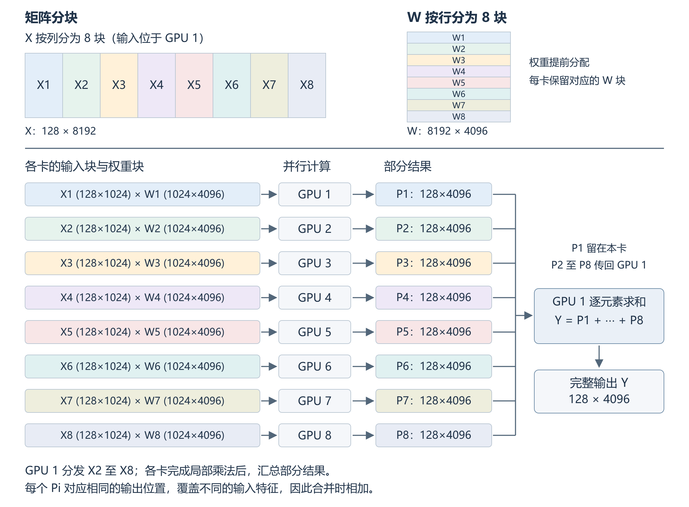

# 一次 FFN 矩阵乘法的多 GPU 划分

## 1. 计算任务与基本假设

Transformer 的前馈网络（FFN）需要通过矩阵乘法变换 token 的特征。本文选取其中一次线性投影，讨论如何用 8 张 GPU 共同完成。

以处理 128 个 token 为例，设每个 token 有 8192 个输入特征，经过投影得到 4096 个输出特征：

\[
Y=XW,\qquad
X\in\mathbb{R}^{128\times8192},\quad
W\in\mathbb{R}^{8192\times4096},\quad
Y\in\mathbb{R}^{128\times4096}.
\]

其中，X 是输入，W 是权重，Y 是输出，输入矩阵的一行对应一个 token。为简化讨论，省略偏置项；若有偏置，在最终求和后加一次即可。

假设各张 GPU 性能相同，权重在模型加载时提前分配到各卡。每次计算的输入和最终输出都位于 GPU 1，运行开销包括输入分发、并行计算和结果汇总，不计一次性的权重加载。

## 2. 按输入特征划分任务

将 8192 个输入特征平均分为 8 组，每组 1024 个。对应到矩阵上，就是将 X 按列分块，W 按相同的特征范围分行：

\[
X=[X_1\ X_2\ \cdots\ X_8],\qquad
W=\begin{bmatrix}W_1\\W_2\\\vdots\\W_8\end{bmatrix}.
\]

选择这一维度，是因为一个输出元素可以先分别计算各组输入特征对应的乘积之和，再把这些和相加。这样，各卡既能独立计算，也只需保存八分之一的权重。均匀划分还能让各卡承担相同的乘法工作量。代价是每张卡都会产生一份与 Y 同样大小的部分结果，最后需要传输并求和。

每个输入块的尺寸为 \(128\times1024\)，每个权重块的尺寸为 \(1024\times4096\)。8 张 GPU 的分工如下：

| GPU | 负责的输入特征，即 X 的列、W 的行 | 计算内容 |
|---|---|---|
| 1 | 1–1024 | \(P_1=X_1W_1\) |
| 2 | 1025–2048 | \(P_2=X_2W_2\) |
| 3 | 2049–3072 | \(P_3=X_3W_3\) |
| 4 | 3073–4096 | \(P_4=X_4W_4\) |
| 5 | 4097–5120 | \(P_5=X_5W_5\) |
| 6 | 5121–6144 | \(P_6=X_6W_6\) |
| 7 | 6145–7168 | \(P_7=X_7W_7\) |
| 8 | 7169–8192 | \(P_8=X_8W_8\) |

例如，GPU 1 只计算前 1024 个输入特征对应的乘积之和，GPU 2 接着计算第 1025–2048 个特征对应的部分。各卡都有自己的输入块和权重块，谁也不必等另一张卡先算完，因此这 8 次乘法可以同时进行。

## 3. 并行求解与结果合并

**Divide（划分）**：沿输入特征维度拆分乘法。若先分成两半，原任务就变为“前 4096 个特征对应的乘法”与“后 4096 个特征对应的乘法”，两者相加可恢复结果。每个子任务仍是矩阵乘法，可以继续按同样方法划分；分到每块 1024 个特征时停止，交给 8 张 GPU。

这种分治关系不要求数据也逐层转发。本文由 GPU 1 保留 \(X_1\)，将其余输入块直接发送给对应 GPU，最后集中求和。

**Conquer（求解）**：第 i 张 GPU 计算 \(P_i=X_iW_i\)，得到一个 \(128\times4096\) 的矩阵。原本每个输出元素要累加 8192 项乘积，现在每张卡只累加自己负责的 1024 项。

**Combine（合并）**：GPU 2–8 将部分结果发送给 GPU 1，由 GPU 1 逐元素累加：

\[
Y=P_1+P_2+\cdots+P_8.
\]

矩阵乘法的每个输出元素，本来就是沿输入特征维度求和。各卡负责的区间互不重叠，合起来恰好覆盖全部 8192 个特征，所以：

\[
Y_{ab}=\sum_{k=1}^{8192}X_{ak}W_{kb}
=\sum_{i=1}^{8}\left(\sum_{k=1024(i-1)+1}^{1024i}X_{ak}W_{kb}\right).
\]

各卡的 \(P_i[a,b]\) 对应的是同一个输出位置，只是覆盖的求和区间不同，因此必须相加，不能直接拼接。浮点计算中的求和顺序会改变，结果可能存在微小的舍入差异。

每次计算传输的数据有两类：开始时分发的输入块，以及结束时汇总的部分结果。权重留在各卡上，局部乘法期间不需要交换数据。

## 4. 增加 GPU 后的性能变化

保持任务规模不变，同时比较每卡的计算量和 GPU 1 的结果接收量：

| GPU 数量 | 每卡输入特征数 | 每卡乘法工作量占比 | GPU 1 接收的部分结果份数 |
|---|---:|---:|---:|
| 1 | 8192 | 1 | 0 |
| 2 | 4096 | 1/2 | 1 |
| 4 | 2048 | 1/4 | 3 |
| 8 | 1024 | 1/8 | 7 |
| 16 | 512 | 1/16 | 15 |

开始增加 GPU 时，原本由一张卡完成的乘法可以同时进行。若通信耗时较少，2 张卡有望将主要计算时间降到原来的一半，4 张卡则降到四分之一。各卡合计的乘法次数没有减少，加速来自同时工作。表中是工作量的理论比较，不是实测耗时。

但从表中也能看到，计算分得越细，GPU 1 要收回的结果反而越多。每份结果都是 \(128\times4096\) 个数：从 8 张卡增加到 16 张，每卡的输入特征减半，传回的结果却从 7 份增加到 15 份，还要在 GPU 1 上相加。这里的增长规律针对本文的集中汇总方式，采用其他通信组织方式时需要重新分析。

继续增加卡数，局部计算本身也未必能按比例变快。矩阵变窄后，GPU 的计算单元可能无法充分利用，启动计算的固定开销却仍然存在。尤其当一次只处理少量 token 时，每张卡分到的工作更少，这些开销就更明显。

此外，完整输出必须等到所有部分结果到齐。某张卡计算较慢或传输延迟，其他卡即使已经完成，也不能提前得到完整答案。增加卡数并不必然增加等待时间，但这种等待会限制实际加速。

忽略计算与通信的重叠，总耗时包括输入分发、最慢一张卡的局部计算，以及结果传输和求和。从 8 张增加到 16 张，理想局部计算时间只再减少单卡计算时间的十六分之一。如果新增的数据传输、求和等开销超过这点节省，16 张卡就会比 8 张更慢。

可以让 GPU 两两先求和，再逐层汇总，以减轻 GPU 1 的压力。不过，传输和等待仍然存在。因此，选用更多 GPU 前，需要比较省下的计算时间与新增的通信、合并时间。

## 5. 与经典分治的联系

本方案与经典分治一样，把同一个问题拆成较小的同类子问题，分别求解后再合并。分治描述算法如何组织子问题，多 GPU 则描述计算如何分配到硬件；分治也可以在单卡上执行。这里的多卡实现增加了通信和同步开销，乘法总量并未减少。仅把互不相关的请求分给不同 GPU，既没有拆解同一个问题，也不需要合成它的答案，不能仅凭“分给多张卡”就称为分治。

## 参考资料

- [NVIDIA Megatron Core：RowParallelLinear](https://docs.nvidia.com/megatron-core/developer-guide/latest/apidocs/core/core.tensor_parallel.layers.html)，线性层的输入与权重分块方式。
